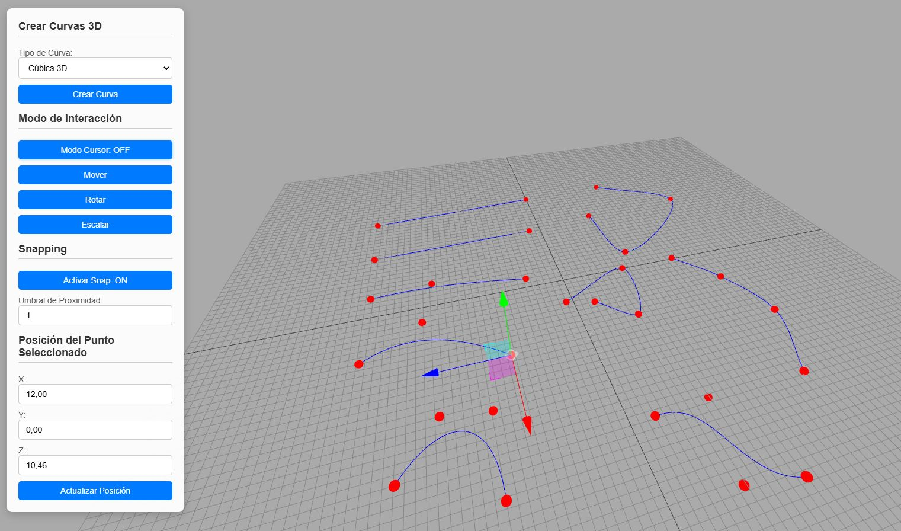

# Control de Curvas 3D Simplificado

## Acceso Rápido a la Aplicación
[3D Curve](https://xococode.github.io/Xococurve.github.io/)

## Descripción

**Control de Curvas 3D Simplificado** es una aplicación web interactiva que permite a los usuarios crear, visualizar y manipular curvas en un espacio 3D utilizando la biblioteca [Three.js](https://threejs.org/). Con una interfaz de usuario intuitiva, los usuarios pueden seleccionar diferentes tipos de curvas, ajustar puntos de control y aplicar transformaciones como mover, rotar y escalar.

## Características

- **Creación de Curvas 3D**: Soporta múltiples tipos de curvas, incluyendo:
  - Línea 3D
  - Cuadrática 3D
  - Cúbica 3D
  - Catmull-Rom 3D

- **Interfaz de Usuario Amigable**:
  - Selección de tipo de curva
  - Modo Cursor para añadir puntos de control directamente en la escena
  - Herramientas de transformación (Mover, Rotar, Escalar)

- **Snapping**:
  - Activar/desactivar el snapping para alinear puntos de control automáticamente
  - Configuración del umbral de proximidad para snapping

- **Actualización en Tiempo Real**: Las curvas se actualizan dinámicamente al mover puntos de control, con soporte para múltiples curvas simultáneamente.

- **Responsive Design**: Adaptable a diferentes tamaños de pantalla, garantizando una experiencia óptima en dispositivos móviles y de escritorio.

